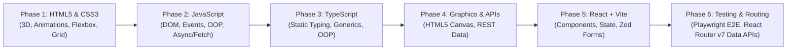

# 🎓 WebAcademy — Full-Stack Web Development Portfolio & Course Journey

[](https://developer.mozilla.org/en-US/docs/Web/HTML)
[](https://developer.mozilla.org/en-US/docs/Web/CSS)
[](https://developer.mozilla.org/en-US/docs/Web/JavaScript)
[](https://www.typescriptlang.org/)
[](https://react.dev/)
[](https://vitejs.dev/)
[](https://reactrouter.com/)
[](https://playwright.dev/)

> 🇷🇴 **Despre acest depozit:** Această arhivă conține toate lecțiile practice (**cursuri**), provocările de codare și temele pentru acasă (**teme**) parcurse în cadrul cursului **WebAcademy**. Proiectul servește drept referință completă de studiu, reflecție și portofoliu.
>
> 🇬🇧 **About this repository:** This repository contains all practical lessons (**cursuri**), coding challenges, and homework projects (**teme**) completed during the **WebAcademy** course. It serves as a comprehensive study reference, learning journal, and project portfolio.

---

## 📑 Table of Contents / Cuprins

- [🌟 Overview & Tech Stack](#-overview--tech-stack)
- [📚 Curriculum & Lesson Index / Index Cursuri](#-curriculum--lesson-index--index-cursuri)
  - [Phase 1: HTML5, CSS3 & 3D Styling](#phase-1-html5-css3--3d-styling-lecțiile-14)
  - [Phase 2: Vanilla JavaScript & DOM](#phase-2-vanilla-javascript--dom-lecțiile-511)
  - [Phase 3: TypeScript Foundations & OOP](#phase-3-typescript-foundations--oop-lecțiile-1218)
  - [Phase 4: Canvas Graphics & Async APIs](#phase-4-canvas-graphics--async-apis-lecțiile-1920)
  - [Phase 5: React & Component Architecture](#phase-5-react--component-architecture-lecțiile-2124)
  - [Phase 6: Testing & Production Routing](#phase-6-testing--production-routing-lecțiile-2528)
- [🎯 Homework & Capstone Projects / Teme](#-homework--capstone-projects--teme)
- [🚀 How to Run the Projects / Ghid de Rulare](#-how-to-run-the-projects--ghid-de-rulare)
- [📁 Repository Structure](#-repository-structure)
- [💡 Key Learnings & Reflections / Concluzii & Reflecții](#-key-learnings--reflections--concluzii--reflecții)

---

## 🌟 Overview & Tech Stack



---

## 📚 Curriculum & Lesson Index / Index Cursuri

### Phase 1: HTML5, CSS3 & 3D Styling (Lecțiile 1–4)

| Lecție | Subiecte Principale (RO / EN) | Tehnologii & Tehnici |
| :--- | :--- | :--- |
| **[Lecția 1](cursuri/lectia1/)** | Poziționare CSS & Structură HTML / CSS Positioning | `position: relative, absolute, fixed, sticky`, Layouts |
| **[Lecția 2](cursuri/lectia2/)** | Tranziții și Transformări CSS / Transitions & 2D Transforms | `transition`, `transform`, `hover` states |
| **[Lecția 3](cursuri/lectia3/)** | Animații CSS `@keyframes` / Keyframe Animations | `@keyframes`, timing functions, infinite loops |
| **[Lecția 4](cursuri/lectia4/)** | Transformări 3D și Perspectivă / 3D Transforms & Slides | `perspective`, `transform-style: preserve-3d`, 3D Carousel |

### Phase 2: Vanilla JavaScript & DOM (Lecțiile 5–11)

| Lecție | Subiecte Principale (RO / EN) | Tehnologii & Tehnici |
| :--- | :--- | :--- |
| **[Lecția 5](cursuri/lectia5/)** | Fundamente JS, Tipuri de date, Bucle & Funcții / JS Basics | Variables, data types, `for/while`, `if/else`, recursion |
| **[Lecția 7](cursuri/lectia7/)** | Manipularea DOM & Evenimente / DOM Events & Selectors | `querySelector`, `addEventListener`, dynamic style updates |
| **[Lecția 8](cursuri/lectia8/)** | Gestionarea formularelor & Tablourilor / Forms & Arrays | Array methods (`map`, `filter`), Form events, Validation |
| **[Lecția 9](cursuri/lectia9/)** | Obiecte, Metode & Prototipuri / Objects & Prototypes | `Object`, `prototype`, constructor functions |
| **[Lecția 10](cursuri/lectia10/)** | Clase ES6 & Programare Orientată pe Obiecte / OOP & Classes | `class`, `constructor`, `extends`, encapsulation |
| **[Lecția 11](cursuri/lectia11/)** | JavaScript Asincron, Promisiuni & Fetch / Async JS | `Promise`, `async/await`, `fetch()` API, Error handling |

### Phase 3: TypeScript Foundations & OOP (Lecțiile 12–18)

| Lecție | Subiecte Principale (RO / EN) | Tehnologii & Tehnici |
| :--- | :--- | :--- |
| **[Lecția 12](cursuri/lectia12/)** | Introducere în TypeScript & Configurare / TS Setup & Types | `tsconfig.json`, primitive types, type annotations |
| **[Lecția 13](cursuri/lectia13/)** | Interfețe & Tipuri Avansate / Interfaces & Generics | `interface`, `type`, Generics `<T>`, Union & Intersection |
| **[Lecția 14](cursuri/lectia14/)** | TypeScript cu DOM & Clase / TS with DOM & Classes | Type casting (`as HTMLElement`), Class modifiers (`private`) |
| **[Lecția 15](cursuri/lectia15/)** | Module, Type Narrowing & Utilități / TS Utilities | Modules (`import`/`export`), Type guards, utility types |
| **[Lecția 16](cursuri/lectia16/)** | Manipulare Date cu Type Safety / Safe Data Processing | Complex types, array/record transformation |
| **[Lecția 17](cursuri/lectia17/)** | Algoritmi & Structuri de Date în TS / Algorithms & DS | Problem solving, algorithmic thinking, strict typing |
| **[Lecția 18](cursuri/lectia18/)** | Bune Practici & Arhitectură TS / Advanced TS Practices | Code modularization, maintainability, type contracts |

### Phase 4: Canvas Graphics & Async APIs (Lecțiile 19–20)

| Lecție | Subiecte Principale (RO / EN) | Tehnologii & Tehnici |
| :--- | :--- | :--- |
| **[Lecția 19](cursuri/lectia19/)** | Grafică HTML5 Canvas 2D & Date JSON / Canvas & APIs | `<canvas>`, 2D rendering context, REST API simulation |
| **[Lecția 20](cursuri/lectia20/)** | Recapitulare & Pregătire React / Review & React Prep | Architecture review, component paradigm foundation |

### Phase 5: React & Component Architecture (Lecțiile 21–24)

| Lecție | Subiecte Principale (RO / EN) | Tehnologii & Tehnici |
| :--- | :--- | :--- |
| **[Lecția 21](cursuri/lectia21/)** | Introducere în React + Vite / React Fundamentals | Vite, JSX, Components, Props, Theme Switcher, ProdusCard |
| **[Lecția 22](cursuri/lectia22/)** | Formulare React & Validare Zod / Zod Schema Validation | Controlled forms, `useState`, Zod validation error handling |
| **[Lecția 23](cursuri/lectia23/)** | Stilizare Componente & Bare de Progres / Progress UI | Dynamic CSS bindings, animated progress bar |
| **[Lecția 24](cursuri/lectia24/)** | Arhitectură de Stare & Lifting State Up / State Patterns | State management, parent-child data flow |

### Phase 6: Testing & Production Routing (Lecțiile 25–28)

| Lecție | Subiecte Principale (RO / EN) | Tehnologii & Tehnici |
| :--- | :--- | :--- |
| **[Lecția 25](cursuri/lectia25/)** | Testare E2E cu Playwright & Componente / E2E Testing | Playwright, Test Suites, Cart, Coin, Timer, Popup, ProdusFavorit |
| **[Lecția 26](cursuri/lectia26/)** | Introducere în React Router / Client-side Routing | `react-router-dom`, `BrowserRouter`, `Routes`, `Route`, `Link` |
| **[Lecția 27](cursuri/lectia27/)** | Rute Imbricate & Parametri Dinamici / Nested Routes & Layouts | Dynamic params (`:id`), Nested outlets, Profile, FileExplorer |
| **[Lecția 28](cursuri/lectia28/)** | React Router v7 Data APIs (CRUD App) / Data Loaders & Actions | `createBrowserRouter`, `loader`, `action`, LocalStorage CRUD |

---

## 🎯 Homework & Capstone Projects / Teme

| Proiect / Temă | Descriere & Obiective | Tehnologii Folosite | Preview / Video |
| :--- | :--- | :--- | :--- |
| **[Tema 1](teme/tema1/)** | **CSS Layouts & Landing Pages:** Implementarea a 3 design-uri responsive pornind de la specificații vizuale. | HTML5, CSS3, Responsive Design | `assets/`, `design1.png`, `design2.png`, `design3.png` |
| **[Tema 2](teme/tema2/)** | **Flexbox & Grid Mastery:** 17 exerciții de aliniere, centrare, grile fluide și layout-uri dinamice. | CSS Flexbox, CSS Grid | [Demo Video](teme/tema2/demo.mp4) |
| **[Tema 3](teme/tema3/)** | **CSS Animations & Interview Prep:** Animații interactive, efecte vizuale și întrebări tipice de interviu. | CSS Keyframes, CSS Variables | [Demo Video](teme/tema3/demo.mp4) |
| **[Tema 5](teme/tema5/)** | **JavaScript Logic Exercises:** Manipularea DOM-ului și prelucrarea structurilor de date. | Vanilla JavaScript, DOM API | `script.js` |
| **[Tema 6](teme/tema6/)** | **Algorithms & Interactive Calculator:** 11 exerciții algoritmice avansate și un calculator funcțional. | JavaScript ES6+, Math Algorithms | [Demo Video](teme/tema6/demo.mp4) |
| **[Tema 7](teme/tema7/)** | **Interactive Calendar Application:** Aplicație completă de calendar interactiv cu evenimente și navigare. | Vite, JavaScript, CSS Grid | `package.json`, `src/` |
| **[Tema 8](teme/tema8/)** | **AimEvolution / Vibecode UI Game:** Aplicație de antrenament reflexe, tracking APM și logică gamificată. | JavaScript Classes, UI State, Canvas/CSS | [Demo Video](teme/tema8/demo.mp4) |

---

## 🚀 How to Run the Projects / Ghid de Rulare

### 1. Simple HTML / Vanilla JavaScript Lessons
Pentru lecțiile bazate pe HTML/CSS/JS simplu (ex: `cursuri/lectia1` - `cursuri/lectia11`, `teme/tema1` - `teme/tema6`):
- Deschide fișierul `index.html` direct în browser, sau
- Folosește extensia **Live Server** în VS Code (click dreapta pe `index.html` → *Open with Live Server*).

### 2. TypeScript Lessons
Pentru lecțiile de TypeScript (ex: `cursuri/lectia12`):
```bash
cd cursuri/lectia12
npm install
npm run build # sau npx tsc -w pentru watch mode
```

### 3. React & Vite Applications
Pentru proiectele create cu Vite & React (ex: `cursuri/lectia21`, `cursuri/lectia22`, `cursuri/lectia25`, `cursuri/lectia26`, `cursuri/lectia27`, `cursuri/lectia28`, `teme/tema7`):
```bash
# Navighează în folderul lecției/proiectului dorit
cd cursuri/lectia28

# Instalează dependențele
npm install

# Pornește serverul de dezvoltare
npm run dev
```

### 4. Running Playwright E2E Tests
Pentru suita de teste Playwright din `cursuri/lectia25`:
```bash
cd cursuri/lectia25
npm install
npx playwright test
# Pentru modul UI:
npx playwright test --ui
```

---

## 📁 Repository Structure

```
webacademy/
├── .vscode/               # VS Code workspace settings & formatting
├── .editorconfig          # Consistent coding styles across editors
├── .prettierrc            # Prettier configuration
├── .gitignore             # Comprehensive ignore rules
├── README.md              # Project documentation and curriculum index
│
├── cursuri/               # 28 Structured Lessons (Lectii de curs)
│   ├── lectia1/ ... lectia4/    # HTML5, CSS3, 3D Transforms
│   ├── lectia5/ ... lectia11/   # JavaScript DOM, OOP, Async
│   ├── lectia12/ ... lectia18/  # TypeScript & Algorithms
│   ├── lectia19/ ... lectia20/  # Canvas Graphics & Review
│   ├── lectia21/ ... lectia24/  # React Fundamentals & Zod
│   ├── lectia25/                # React Components & Playwright E2E Tests
│   └── lectia26/ ... lectia28/  # React Router v6/v7 CRUD Project
│
└── teme/                  # 8 Capstone & Homework Projects
    ├── tema1/ ... tema3/        # Slicing, Grid & CSS Animations
    ├── tema5/ ... tema6/        # JS Logic & Calculator
    ├── tema7/                   # Interactive Calendar App (Vite)
    └── tema8/                   # AimEvolution Game / Vibecode
```

---

## 💡 Key Learnings & Reflections / Concluzii & Reflecții

- **De la CSS de bază la React Router v7:** Înțelegerea profundă a DOM-ului nativ și a modelului de evenimente înainte de a trece la React a făcut conceptele de stare, re-render și Virtual DOM mult mai intuitive.
- **Beneficiul TypeScript:** Adăugarea tipurilor statice după stăpânirea JavaScript Vanilla a eliminat o întreagă categorie de bug-uri legate de date `undefined` sau acces la elemente DOM nule.
- **Arhitectura React Router v7:** Trecerea de la `useEffect` + `useState` pentru data fetching la rutere cu `loader` și `action` simplifică fluxurile CRUD și face aplicațiile mult mai robuste.

---

*Creat și întreținut cu pasiune pe parcursul cursurilor WebAcademy.*
